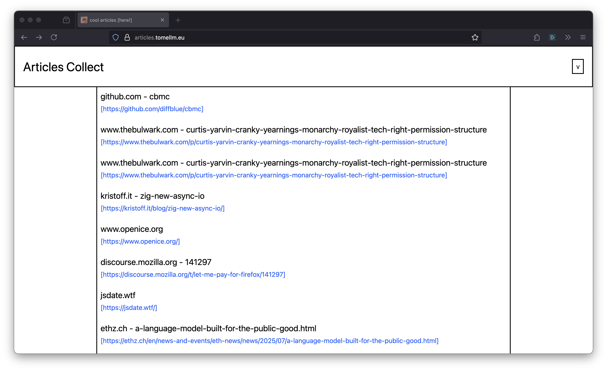

# Articles Collect
> https://articles.tomellm.eu

My small test project to collect articles I find interesting. 



## Scope
Its supposed to kill to birds with one stone:
1. By allowing me to test developing and deploying a Leptos application but also
using keycloak for the auth.
2. By giving me a space to collect all of the articles I find on bluesky, reddit
usw.

## Architecture
Since this is a project to test a few different things out the architecture is
unnessearily complicated. I have tried to create different packages for different
parts of the application to reduce the dependence on specific dependencies, although
there is still some cleanup needed.

```
./
 ┬─ projects
 |      ┬─ domain       -> obiously contains the domain, has do deps
 |      └─ server       -> subdir for all server code
 |          └─ databse  -> code to work with the db
 └─ web_app             -> the actual application
```

## Deployment
The deployment very simply works by publishing a [docker image (tomellm/articles_collect)](https://hub.docker.com/repository/docker/tomellm/articles_collect/general)
to the docker hub container registry. That image is then deployed on my coolify
instance simply by fetching the latest tag of the Deployed through Github actions 
and my own Coolify instance.

## Run it Yourself
Unfortunatly I have not provided docker compose or similar to start up all of the
infastructure. If you still want to give it a try you will have to install [`cargo-leptos`](https://github.com/leptos-rs/cargo-leptos)
toto build and run the application. The .env-template file defines the environment
variables expected by the application meaning:
- keycloak
- a postgres db (migration scripts are automatically executed)

Once you have these up and running, just execute: `cargo leptos watch`
